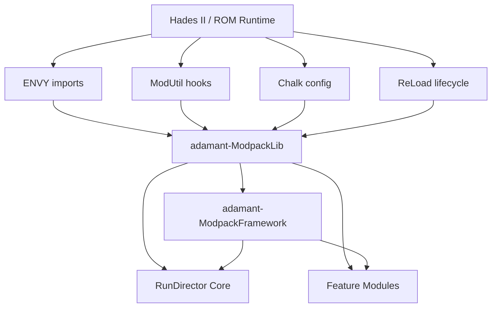
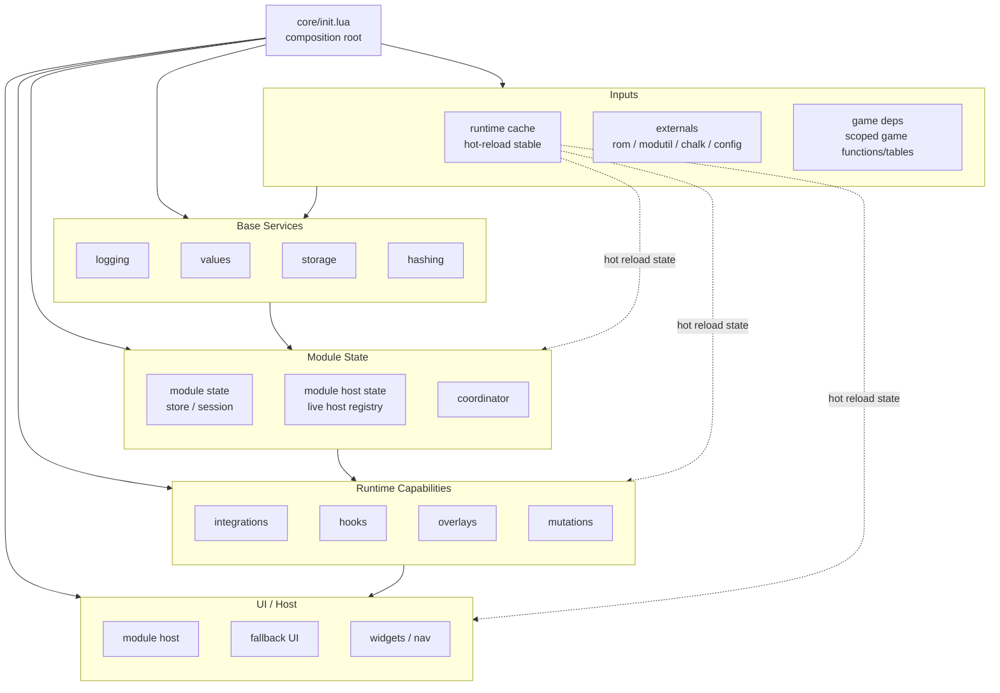
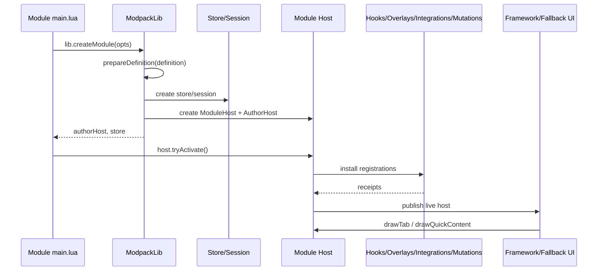
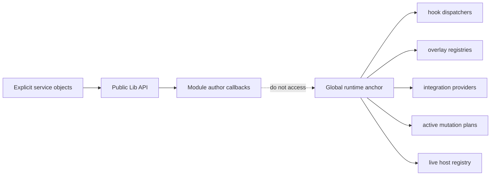
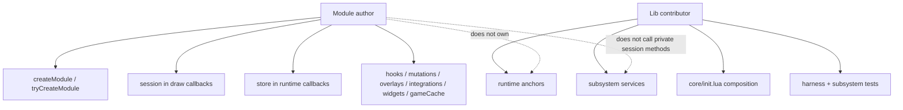

# System Infrastructure

This document explains how ModpackLib, Framework, module authors, and external runtime systems fit together.

## Stack Overview

## Lib Composition Root

`src/core/init.lua` is the Lib composition root. It creates the shared runtime anchor, imports external dependencies, constructs services, and passes explicit dependencies into subsystems.

## Module Lifecycle

Module authors normally touch only `lib.createModule(...)`, callbacks, and `host.tryActivate()`.

## Runtime Ownership

Persistent globals are only for hot-reload-stable anchors. Normal dependencies move through explicit composition.

## Author vs Contributor Surface

## Design Rules

- Validate broad shape at contact points.
- Trust prepared internal values after construction.
- Pass dependencies explicitly.
- Use hot-reload runtime anchors only for state that must survive reload.
- Keep module author APIs separate from Lib contributor internals.
- Prefer capability guides for module-facing behavior and `API.md` for exact surface.
